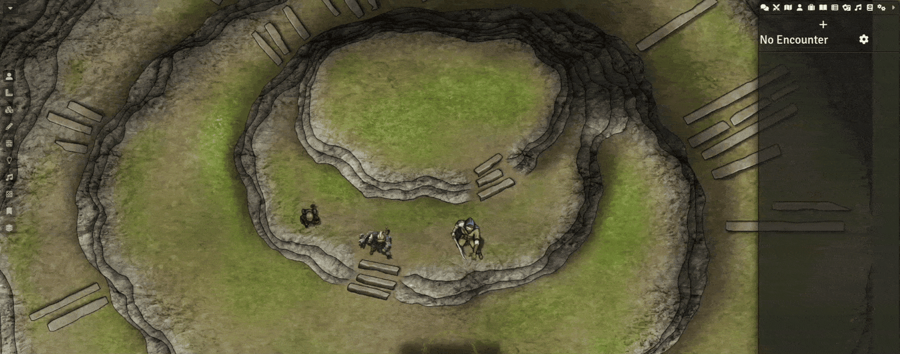

# Token Action HUD TOR2e

This module adds a repositionable HUD for The One Ring 2nd Edition, giving you quick access to actions and information for any selected token or group of tokens. Perform all actions from your character, community, adversary, and NPC sheets directly through the menu, and access their information without ever opening a sheet.

# Features
- Roll dice directly from the HUD without opening your character sheet.
- Use items from the HUD, or right-click an item to open its sheet.
- Equip or unequip weapons and armor with Ctrl/Alt/Shift + Click directly from the HUD.
- Use LM utilities in the Miscellaneous menu to add or remove combatants, target or untarget tokens, and apply effects or statuses to multiple selected tokens.
- Organize your macros into folders and access them easily from the Macros menu.
- Move the HUD freely and choose whether menus expand upward or downward.
- Unlock the HUD to customize groups and actions.

# Required Modules

## Token Action HUD Core
Token Action HUD TOR2e requires the [Token Action HUD Core](https://foundryvtt.com/packages/token-action-hud-core) module.

## socketlib
Token Action HUD Core requires the [socketlib](https://foundryvtt.com/packages/socketlib) library module.

# Recommended Modules
Token Action HUD uses the [Color Picker](https://foundryvtt.com/packages/color-picker) library module for its color picker settings.

# Support

For a guide on using Token Action HUD, go to: [How to Use Token Action HUD](https://github.com/Larkinabout/fvtt-token-action-hud-core/wiki/How-to-Use-Token-Action-HUD)

For questions, feature requests or bug reports, please open an issue [here](https://github.com/tdakanalis/token-action-hud-tor2e/issues).
